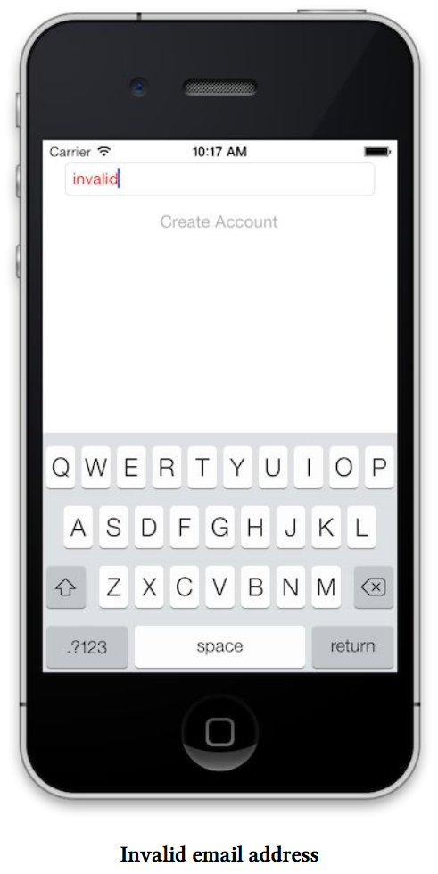
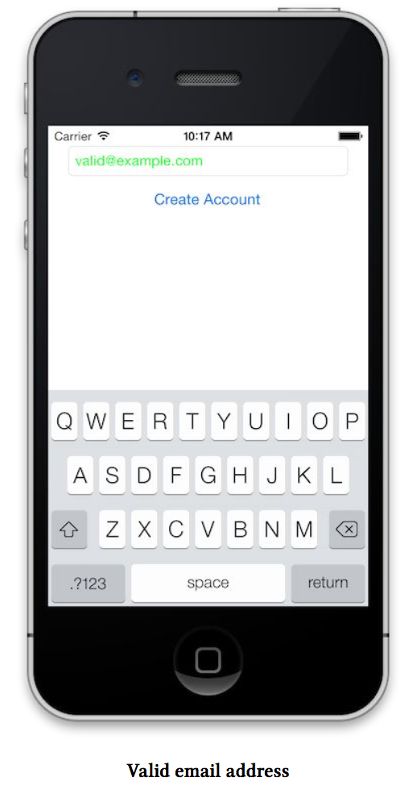

# 状态推导
状态推导是ReactiveCocoa的另一个核心组件。这里并非指类的某个属性(设置一个新的值就代表状态发生了改变那样)，这里我们指的是把属性抽象为流。就拿前面的例子，我们为她增加状态推导。

假设我们的视图是用来创建账户的，我们只允许包含有'@'字符的Email地址，当且仅当，输入的用户名有效时使按键可用，同时我们也希望通过TextField中Text的颜色给用户提供反馈。

 - 首先我们使用IBOutlet在视图上增加一个按键‘button’.
   
 - 其次我们将button的enable属性与我们创建的信号绑定。

```Objective-C
RAC(self.button, enabled) = [self.textField.rac_textSignal map:^id (NSString *value){
    return @([value rangeOfString:@"@"].location != NSNotfound);
}];
```
请注意，稍候将看到我们如何使用buttons的命令来更好地约束她的enable属性。

`RAC()`宏需要两个参数:‘对象’以及这个对象的某个属性的'keyPath'。然后将表达式右边的值和'keyPath'做一个单向的绑定，这个值必须是NSObject类型，所以我们会把boolean量封装成NSNumber。

但是，文本的颜色怎么办?实际上我们在这个基础上做一点点重构就可以了。

```Objective-C
RACSignal * validEmailSignal = [self.textField.rac_textSignal map:^id (NSString *value){
    return @([value rangeOfString:@"@"].location != NSNotFound);
}];

RAC(self.button, enabled) = validEmailSignal;

RAC(self.button, textColor) = [validEmailSignal map: ^id (id value){
    if([value boolValue]){
        return [UIColor greenColor];
    }else{
        return [UIColor redColor];
    }
}];

```





很好！看到我们怎样复用validEmailSignal吗？这在ReactiveCocoa中是非常常见的用法。在viewDidLoad方法之外，我们也不用写任何代码，这也很常见。

