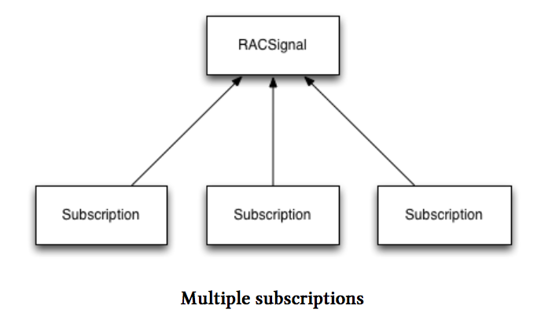
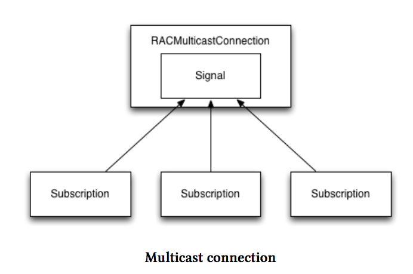

# 组播

组播是用语多个订阅者共享一个订阅信号的术语。就像我们上一节所描述的那样，默认的情况下，信号是冷的。有时候，我们不希望一个冷信号在每一次被订阅时工作。这通常在边界效应、订阅所要执行的任务代价昂贵或者只能以其他方式在适当的时间执行时有这种需求。这时网络请求浮现在脑海中。。。

所以与其从这样的信号中创建一个`RACMulticastConnection`,不如使用`RACSignal`的`publish`方法或者`multicast:`方法。前者为您创建一个组播连接，后者也一样为您创建一个组播连接但需要一个`RACSubject`参数。当她被调用时这个RACSubject可以通过底层信号发送一个值出来。任何对这个值有兴趣的，都可以用这个从底层信号发送一个值到连接的信号来替代你提供的`RACSubject`，这个信号恰好就等同于你的这个`RACSubject`.

为了说明这种不同，请参考下面的插图：

由于信号是冷启动的，每增加一个订阅者，她就会被执行一次。这种情况是我们不希望看到的，可以使用组播连接来改善。

信号的组播连接订阅，当她传送一个新值的时候，是通过公共频道来传送给信号的。只要你喜欢你可以随意订阅这个信号，但这个信号在订阅相关的操作上有且仅会执行一次，不再像以前那样增加一个订阅者这个信号上就执行一次订阅相关的操作。
