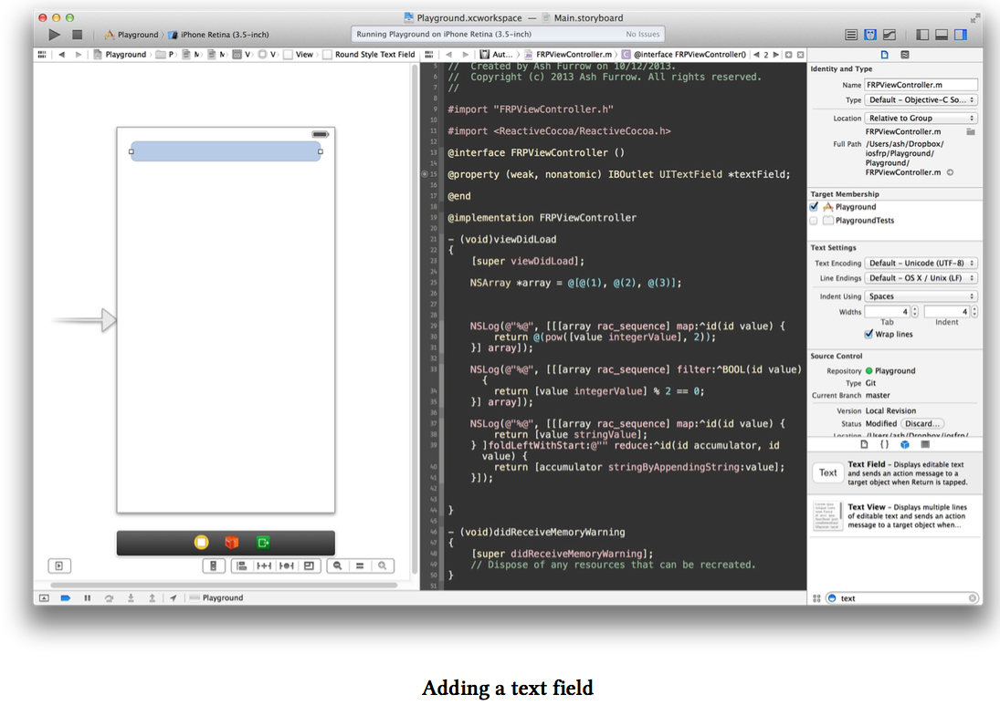
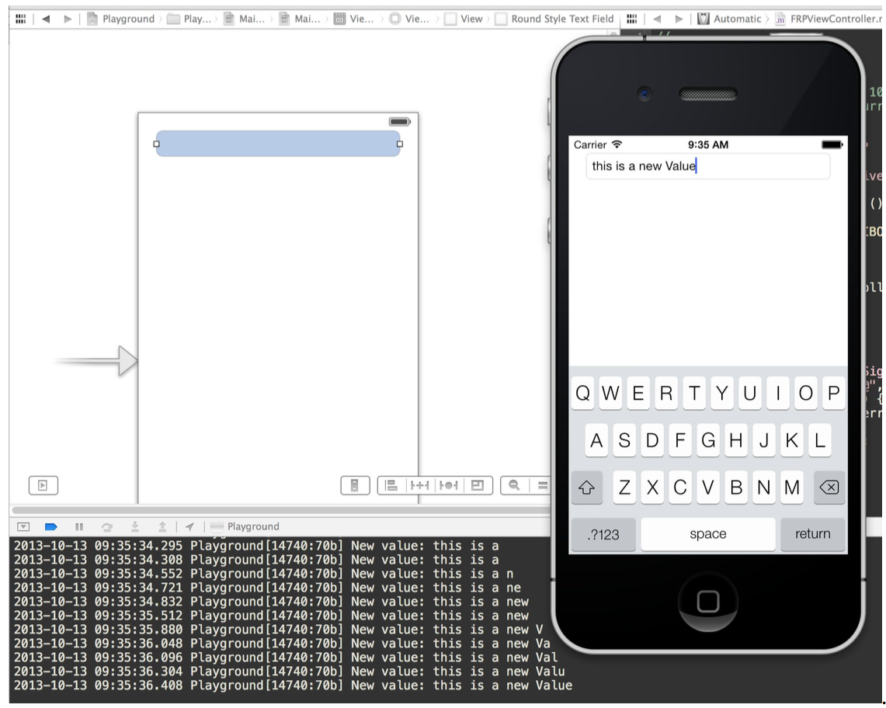

# 订阅
当你随时都想知道某一个值的改变时(不管是next、error或者completion),你就会订阅流---一种最常见的signal.使用信号通常都会有副作用，比如下面这个例子。

&nbsp;&nbsp;我们添加一个textfield控件到viewController's View上，这里我使用storyboard来做，你怎么做随你喜好。



在ViewDidLoad中添加如下代码，订阅textfield的rac_textSignal。

```
[self.textField.rac_textSignal subscribeNext:^(id x){
    NSLog(@"New Value: %@",x);
} error:^(NSError * error){
    NSLog(@"Error : %@", error);
} completed:^{
    NSLog(@"Completed.");
}];
```

创建并运行应用程序，在textField上输入一些内容。每一次每一个新的值输入到textField中，这个`Next value`就会下发到管道中，然后我们的订阅块就会被执行。



有趣的是，这个特殊的信号不会发送错误值，仅仅在释放的时候发送一个完成值，所以这两个订阅块通常不会被调用。我们可以使用RACSignal上的一个简便的方法`subsribeNext:`来简化我们的代码:
```
[self.textField.rac_textSignal subscribeNext:^(id x){
    NSLog(@"New Value: %@", x);
}];
```
看吧，少了很多代码!

当你订阅一个信号时，实际上你创建了一个'订阅者'，她是自动保留的，并同时保留她订阅的信号，你也可以手动配置这个‘订阅者’，但这不是一种典型的行为。下一章我们将会学习，当视图复用的时候(像CollectionViewCells 或TableViewCells)，如何去有效地配置信号。
