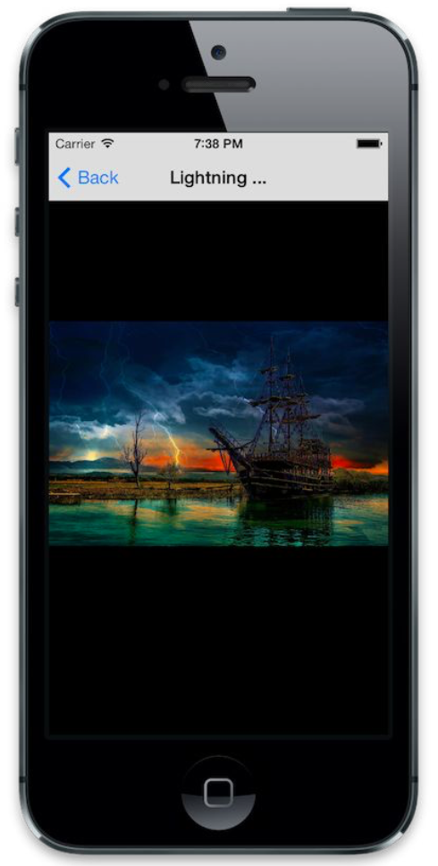

# 添加FunctionalReactivePixels

一个简单的画廊弄好了，但是我们是不是想看一下高清图呢？当用户点击画廊中的某一个单元格时，我们创建一个新的视图控制器并将其推入到导航堆栈中。

```
- (void)collectionView:(UICollectionView *)collectionView
	didSelectItemAtIndexPath:(NSIndexPath *)indexPath{
	FRPFullSizePhotoViewController * viewController = [[FRPFullSizePhotoViewController alloc] initWithPhotoModels:self.photosArray currentPhotoIndex:indexPath.item];

	viewController.delegate = self;
	[self.navigationController pushViewController:viewController animated:YES];

}
```

这个方法没有任何特殊的，只是些一般的OC方法。当然别忘了在当前实现文件里加载视图控制器(FRPFullSizePhotoViewControler)的头文件.现在让我们来创建这个视图控制器(FRPFullSizePhotoViewControler).

创建一个UIViewController的子类FRPFullSizePhotoViewControler,这不会是一个特别的‘Reactive’的视图控制器，实际上大部分只是`UIPageViewController`子视图控制器的模版。

```
@class FRPFullSizePhotoViewController;

@protocol FRPFullSizePhotoViewControllerDelegate <NSOject>
- (void)userDidScroll:(FRPFullSizePhotoViewController *)viewController toPhotoAtIndex:(NSInteger)index;

@end

@interface FRPFullSizePhotoViewController : UIViewController

- (instancetype)initWithPhotoModels:(NSArray *)photoModelArray currentPhotoIndex:(NSInteger)photoIndex;

@property (nonatomic , readonly) NSArray *photoModelArray;
@property (nonatomic, weak) id<FRPFullSizePhotoViewControllerDelegate> delegate;

@end

```

回到画廊视图控制器实现必要的代理方法：

```
- (void)userDidScroll:(FRPFullSizePhotoViewController *)viewController toPhotoAtIndex:(NSInteger)index{
	[self.collectionView scrollToItemAtIndexPath:[NSIndexPath indexPathForItem:index inSection:0]
				atScrollPosition:UICollectionViewScrollPositionCenteredVertically
						animated:NO];
}
```

当我们滑到一个新的图像去查看其高清图片时，这个方法将更新collectionView滑动的位置。这样一来，当用户查看完高清图回到这个界面的时候，高清图所对应的缩略图将会显示在界面上，方便用户获知自己浏览的位置以及继续往下浏览。

`#import`这些必要的数据模型的头文件并追加一下两个私有属性：

```
@interface FRPFullSizePhotoViewController () <UIPageViewControllerDataSource, UIPageViewControllerDelegate>
//Private assignment
@property (nonatomic, strong) NSArray *photoModeArray;
//Private properties
@property (nonatomic, strong) UIPageViewController *pageViewController;
@end
```

`photoModelArray`是共有的只读属性，但是内部可读写。第二个属性是我们的子视图控制器。我们这样来初始化：

```
- (instancetype)initWithPhotoModels:(NSArray *)photoModelArray currentPhotoIndex:(NSInteger)photoIndex{
	self = [self init];
	if (!self) return nil;

	//Initialized, read-only properties
	self.photoModelArray = photoModelArray;

	//Configure self
	self.title = [self.photoModelArray[photoIndex] photoName];

	//ViewControllers
	self.pageViewController = [UIPageViewController alloc]
									initWithTransitionStyle:UIPageViewControlerTransitionStyleScroll
									navigationOrientation:UIPageViewControllerNavigationOrientationHorizontal
									options:@{ UIPageViewControllerInterPageSpacingKey: @(30)};
	self.pageViewController.dataSource = self;
	self.pageViewController.delegate = self;
	[self addchildViewController:self.pageViewController];

	[self.pageViewController setViewController:@[[self photoViewControllerForIndex:photoIndex]]
							direction:UIPageViewControllerNavigationDirectionForward
							animated:NO completion:nil ];

	return self;
}
```

赋值属性、设置标题、配置我们的`pageViewController`，一切都非常无聊，我们的viewDidLoad方法也同样简单。

```
- (void)viewDidLoad{
	[super viewDidLoad];

	self.view,backGroundColor = [UIColor blackColor];

	self.pageViewController.view.frame = self.view.bounds;

	[self.view addSubView:self.pageViewController.view];
}
```
我要指出的是，简便起见，在我的应用里我禁用了横向展示，因为这不是一本关于`autoresizingMask`或者`autoLayout`的书。你可以通过[Eria Sadun的书](http://www.amazon.com/Layout-Demystified-Edition-Mobile-Programming/dp/0321967194)了解更多关于`autoLayout`方面的细节。

下面我们来了解一下UIPageViewController的数据源协议和代理协议。

```
- (void)pageViewController:(UIPageViewController *)pageViewController
	didFinishAnimating: (BOOL)finished
	previousViewControllers:(NSArray *)previousViewControllers
	transitionCompleted:(BOOL)completed{
		self.title = [[self.pageViewController.viewControllers.firstObject photoModel] photoName];
		[self.delegate userDidScroll:self toPhotoAtIndex:[self.pageViewController.viewControllers.firstObject photoIndex]];
	}

- (UIViewController *)pageViewController:(UIPageViewController *)pageViewController viewControllerBeforeViewController:(FRPPhotoViewController *)viewController{
	return [self photoViewControllerForIndex:viewController.photoIndex - 1];
}

- (UIViewController *)pageViewController:(UIPageViewController *)pageViewController viewControllerAfterViewController:(FRPPhotoViewController *)viewController {
	return [self photoViewControllerForIndex:viewController.photoIndex + 1];
}

```
虽然这些方法没有技术上的`reactive`，却体现出一定意义上的实用性。我很佩服这种在特殊类型的视图控制器上的抽像，干得漂亮，Apple！

我们的视图控制器创建方法，类似下面这样：

```
- (FRPPhotoViewController *)photoViewControllerForIndex:(NSInteger)index{
	if (index >= 0 && index < self.photoModelArray.count){
		FRPPhotoModel *photoModel = self.photoModelArray[index];

		FRPPhotoViewController *photoViewController = [[FRPPhotoViewController alloc] initWithPhotoModel:photoModel index:index];

		return photoViewController;
	}

	//Index was out of bounds, return nil
	return nil;
 }
```
它基本上创建比配置了一个我们将要使用的UIViewController的子视图控制器FRPPhotoViewController。下面是他的头文件：

```
@class FRPPhotoModel;

@interface FRPPhotoViewController : UIViewController
- (instancetype)initWithPhotoModel:(FRPPhotoModel *)photoModel index:(NSInteger)photoIndex;

@property (nonatomic, readonly) NSInteger photoIndex;
@property (nonatomic, readonly) FRPPhotoModel * photoModel;

@end

```
这个视图控制器非常简单：显示一个photoModel下的高清图片，并提示photoImporter(单例对象)下载这个图片。它是如此简单，我现在就告诉你它的全部实现。

```
//Model
#import "FRPPhotoModel.h"

//Utilities
#import "FRPPhotoImporter.h"
#import <SVProgressHUD.h>

@interface FRPPhotoViewController ()
//Private assignment
@property (nonatomic, assign) NSInteger photoIndex;
@property (nonatomic, strong) FRPPhotoModel *photoModel;

//Private properties
@property (nonatomic, weak) UIImageView * imageView;

@end

@implementation FRPPhotoViewController

- (instancetype)initWithPhotoModel:(FRPPhotoModel *)photoModel index:(NSInteger)photoIndex{
	self = [self init];
	if (!self) return nil;

	self.photoModel = photoModel;
	self.photoIndex = photoIndex;

	return self;
}

- (void)viewDidLoad{
	[super viewDidLoad];

	//Configure self's view
	self.view.backGroundColor = [UIColor blackColor];

	//Configure subViews
	UIImageView *imageView = [[UIImageView alloc] initWithFrame:self.view.bounds];

	RAC(imageView, image) = [RACObserve(self.photoModel, fullsizeData) map:^id (id value){
										return [UIImage imageWithData:value];
									}];

	imageView.contentMode = UIViewContentModeScaleAspectFit;
	[self.view addSubView:imageView];
	self.imageView = imageView;
}

- (void)viewWillAppear:(BOOL)animated{
	[super viewWillAppear:animated];
	[SVProgressHUD show];

	//Fetch data
	[[FRPPhotoImporter fetchPhotoDetails:self.photoModel]
			subscribeError:^(NSError *error){
				[SVProgressHUD showErrorWithStatus:@"Error"];
			}
			completed:^{
				[SVProgressHUD dismiss];
			}];
}

@end

```
就像我们的collectionViewCell中那样，我们将UIImageView的image属性和数据模型的某个属性映射后的值绑定，所不同的是ViewController不需要考虑复用，所以我们不必计较怎么取消imageView的订阅---当imageView对象解除分配的时候，订阅将会被取消。

这个实现里面另一个有趣的部分在`viewWillAppear:`里：

```
[SVProgressHUD show];
//Fetch data
[[FRPPhotoImporter fetchPhotoDetails:self.photoModel]
		subscribeError:^(NSError * error){
			[SVProgressHUD showErrorWithStatus:@"Error"];
		}
		completed:^{
			[SVProgressHUD dismiss];
		}];
```
没有收到错误或者完成信息之前，我们必须给用户展示网络请求的状态。你看，500px的受欢迎的照片的API接口只返回了一个照片的大概信息，但我们需要这个照片更详细的信息，所以我们必须调用第二个API接口来获取每一个照片的详细信息（包括全尺寸照片的URL）。

```
+ (NSURLRequest *)photoURLRequest:(FRPPhotoModel *)photoModel{
	return [AppDelegate.apiHelper urlRequestForPhotoID:photoModel.identifier.integerValue];
}
```

我们还没有实现`fetchPhotoDetails:`方法，所以现在我们回到`FRPPhotoImporter`中，在头文件中定义这个方法，在实现文件中实现它。

```
+ (RACReplaySubject *)fetchPhotoDetails:(FRPPhotoModel *)photoModel {
	RACReplaySubject * subject = [RACReplaySubject subject];
	NSURLRequest *request = [self photoURLRequest:photoModel];

	[NSURLConnection sendAsynchronousRequest:request
		queue:[NSOperationQueue mainQueue]
		completionHandler:^ (NSURLResponse *response, NSData * data, NSError *connectionError){
			if(data){
				id results = [NSJSONSerialization JSONObjectWithData:data options:0 error:nil][ @"photo" ];

				[self configurePhotoModel:photoModel withDictionary:results];
				[self downloadFullsizedImageForPhotoModel:photoModel];

				[subject sendNext:photoModel];
				[subject sendCompleted];
			}
			else{
				[subject sendError:connectionError];
			}
		}];

	return subject;
}
```

这种方法跟前面我们看到的`importPhotos`方法模式一样，我们的`downloadFullsizedImageForPhotoModel:`方法跟`downloadThumbnailForPhotoModel:`方法也是一样的。除了这两者之外，还有什么重要的抽象方法呢？让我们来完成我们的缩略图方法。

```
+ (void)downloadThumbnailForPhotoModel:(FRPPhotoModel *)photoModel {
	[self download:photoModel.thumbnailURL withCompletion:^(NSData *data){
		photoModel.thumbnailData = data;
	}];
}

+ (void)downloadFullsizedImageForPhotoModel:(FRPPhotoModel *)photoModel {
	[self download:photoModel.fullsizedURL withCompletion:^(NSData * data){
		photoModel.fullsizedData = data;
	}];
}

+ (void)downloadFullsizedImageForPhotoModel:(FRPPhotoModel *)photoModel {
	[self download:photoModel.fullsizedURL withCompletion:^(NSData *data){
		photoModel.fullsizedData = data;
	}];
}

+ (void)download:(NSString *)urlString withCompletion:(void(^)(NSData * data))completion{
	NSAssert(urlString, @"URL must not be nil" );

	NSURLRequest *request = [NSURLRequest requestWithURL:[NSURL URLWithString:urlString]];
	[NSURLConnnection sendAsynchronousRequest:request queue:[NSOperationQueue mainQueue] completionHandler:^(NSURLResponse *response, NSData *data, NSError *connectionError){
		if (completion){
			completion(data);
		}
	}];
}

```
我曾经与这样一位客户工作过，他认为如果你某行一样的代码重复写两次，这代码就应该得到某种程度的抽象。虽然我认为这有点偏激，但我喜欢这种态度。

好了。我们现在可以运行这个应用，点击一个图片去查看它的高清图片。我们也可以向前或者向后滑动来查看前一个或后一个高清图片。非常棒！




