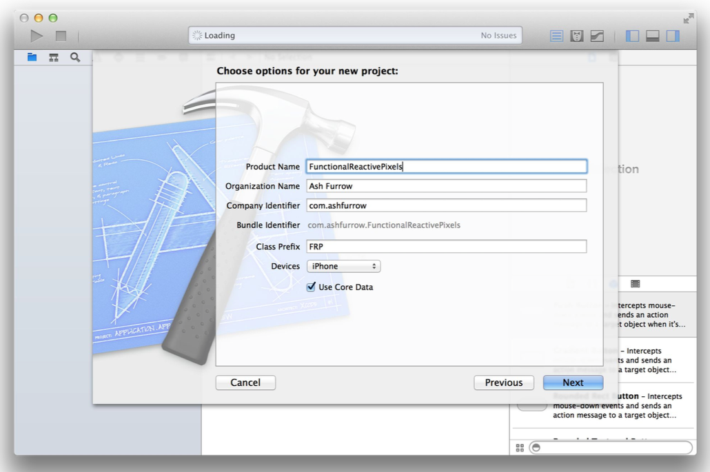
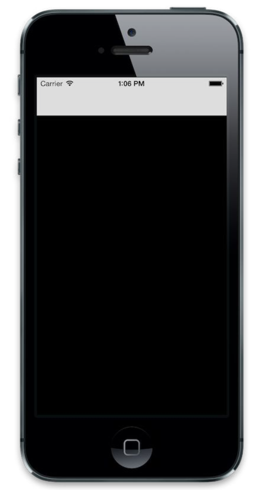
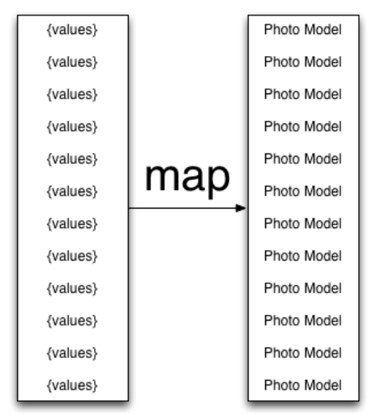
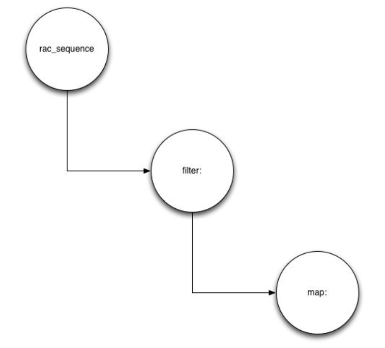
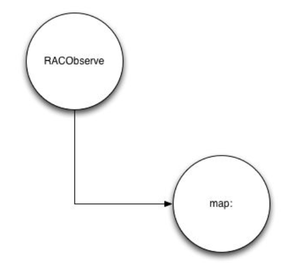

# FunctionalReactivePixels的基础知识
FunctionReactivePixels将会是一个简单的观看'500px'中最受欢迎的照片的应用。一旦我们完成这一节，应用的主界面将会像下面这样：


当然我们也可以像下图一样观看全屏模式下的图片。


这个App将使用Collection Views。如果你没有太多这方面的经验，也不需要太过担心---他们(CollectionView)就像TableView一样，使用起来非常简单。如果你对UICollectionView感兴趣，可以阅读我的[另一本书](http://www.amazon.com/iOS-UICollectionView-Complete-Edition-Programming-ebook/dp/B00IHZKDCU).

我们将使用CocoaPods来管理我们的依赖，现在创建一个新的工程。我喜欢使用空模版以便我可以完全控制viewController层级。



首先、我们将创建一个UICollectionViewController的子类FRPGalleryViewController.同时我们创建一个UICollectionViewFlowLayout的子类FRPGalleryFlowLayout.

```
#import the new flow layout's header in the view controller's implementation file and
#then override FRPGalleryViewController's init method

- (id)init{
    FRPGalleryFlowLayout *flowLayout = [[FRPGalleryFlowLayout alloc] init];
    self = [self initWithCollectionViewLayout:flowLayout];
    if(!self) return nil;
    return self;
}

```

这将初始化collection View的layout为我们自己的layout.这个flowlayout子类的实现非常简单，只需要设置一些属性就可以了。

```
@implementation FRPGalleryFlowLayout
- (instancetype)init{
    if (!(self = [super init])) return nil;

    self.itemSize = CGSizeMake(145,145);
    self.minimumInteritemSpacing = 10;
    self.minimumLineSpacing = 10;
    self.sectionInset = UIEdgeInsetsMake(10,10,10,10);

    return self;
}
@end
```

很棒!下一步，我们需要把Viewcontroller展现在屏幕上。为了实现这个，我们首先要在应用的application delegate的`application: didFinishLaunchingWithOptions:`方法。我们想要将collectionview Controller置于一个navigationController容器中：

```
- (BOOL)application:(UIApplication *)application
    didFinishLaunchingWithOptions:(NSDictionary *)launchOptions{
    self.window = [[UIWindow alloc] initWithFrame:[[UIScreen mainScreen] bounds]];
    self.window.rootViewController = [[UINavigationController alloc] initWithRootViewController:[[FRPGalleryViewController alloc] init]];

    self.window.backgroundColor = [UIColor whiteColor];
    [self.window makeKeyAndVisible];
    return YES;
}
```
很好!如果我们现在运行，我们将看到一个空视图。



我们来填充一些内容。创建一个Podfile文件,并填写如下内容:
```
platform :ios, "7.0"
target "FRP" do
    pod 'ReactiveCocoa', '~> 2.1.4'
    pod 'libextobjc', '~> 0.3'
    pod '500-iOS-api', '~> 1.0.4'
    pod 'SVProgressHUD', '~> 0.9'
end

target "FRPTests" do

end
```
下一章，我们将添加一些测试。现在运行`pod install`,然后打开Xcode通用的`workspace`文件。打开与编译头文件`FRP-Prefix.pch`(Xcode6之后，新建工程默认不加载pch文件，需要自己添加，Apple的最佳实践中已经不推荐使用全局的预编译pch文件)，然后添加下面的内容。这些语义会自动加载到项目的所有文件中。

```
//Pods
#import <ReactiveCocoa/ReactiveCocoa.h>
#import <500px-iOS-api/PXAPI.h>
#import <libextobjc/EXTScope.h>

//App Delegate
#import "FRPAppDelegate.h"
#define AppDelegate ((FRPAppDelegate *)[[UIApplication sharedApplication] delegate])

```

对于这样使用AppDelegate单例的用法，Saul Mora说：“每次看到你这么做，我家的狗都想死”。
但是这不是一本关于设计模式的书---这是一本关于ReactiveCocoa的书，所以我们可能要害死一些狗狗。。。

创建一个AppDelegate的属性来hold住500px API客户端


```
@property (nonatomic, readonly) PXAPIHelper * apiHelper;

```

在`application:didFinishLaunchingWithOptions:`方法中实例化这个变量。

```
self.apiHelper = [[PXAPIHelper alloc]
                    initWithHost:nil
                    consumerKey:@"DC2To2BS0ic1ChKDK15d44M42YHf9gbUJgdFoF0m"
                    consumerSecret:@"i8WL4chWoZ4kw9fh3jzHK7XzTer1y5tUNvsTFNnB"];
```

我提供了一对一次性消费的密钥---请不要疯到你也使用这对密钥，你可以[申请](https://500px.com/)自己的。

好了，我们差不多也该建立数据的加载了。我们需要一个数据模型来hold住我们的信息。我创建了下面的`FRPPhotoModel`。

```
@interface FRPPhotoModel : NSObject
@property (nonatomic, strong) NSString *photoName;
@property (nonatomic, Strong) NSNumber *identifier;
@property (nonatomic, strong) NSString *photographerName;
@property (nonatomic, strong) NSNumber *rating;
@property (nonatomic, strong) NSString *thumbnailURL;
@property (nonatomic, strong) NSData *thumbnailData;
@property (nonatomic, strong) NSString *fullsizedURL;
@property (nonatomic, strong) NSData * fullsizedData;


@end

@implementation FRPPhotoModel

@end
```

非常好，到这里，我们将不直接在ViewController中加载内容，相反，这部分逻辑将被抽象到另一个类中。创建一个名为`FRPPhotoImporter`的类。

到现在为止没有一处代码是关于函数式的。别担心，我们就要这么做了！这个`FRPPhotoImporter`将不会真正返回一个`FRPPhotoModel`对象，相反他会返回一些随身携带API最新的请求结果的信号。

```
@interface FRPPhotoImporter : NSObject
+ (RACSignal *)importPhotos;

@end
```
`FRPPhotoImporter`的`importPhotos`方法返回一个从API发送最新结果的RACSignal。这个RACSignal实际上是一个RACReplaySubject.但是由于ReactiveCocoa编程指南中不建议使用RACSubjects，我们申明的公共接口的返回类型为RACSignal而非RACSubject.现在让我们继续往下看:

```
+ (RACSignal *)importPhotos{
    RACReplaySubject * subject = [RACReplaySubject subject];
    NSURLRequest * request = [self popularURLRequest];
    [NSURLConnection sendAsynchronousRequest:request
    								queue:[NSOperationQueue mainQueue]
    					completionHandler:^(NSURLResponse *response, NSData *data, NSError *connectionError){
    						if (data) {
    							id results = [NSJSONSerialization JSONObjectWithData:data options:0 error:nil];

    							[subject sendNext:[[[results[@"photos"] rac_sequence] map:^id(NSDictionary *photoDictionary){
    								FRPPhotoModel * model = [FRPPhotoModel new];

    								[self configurePhotoModel:model withDictionary:photoDictionary];
    								[self downloadThumbnailForPhotoModel:model];

    								return model;
    							}] array];

    							[subject sendCompleted];
    						}
    						else{
    							[subject sendError:connectionError];
    						}
    }];

    return subject;

}
```

这里面包含的内容太多，我们慢慢来整理一下：

- 首先我们创建了一个新的`RACReplaySubject`实例(这将是我们要返回的对象)。
- 其次我们创建了一个`NSURLRequest`来获取500px上热门的`FRPPhotoModel`数据。
- 随后我们发送一个网络的异步请求，并立即返回RACSubject对象。

这个直接返回的结果值得我们关注。

这个RACSubject对象被异步网络请求的回调block捕获，当API接口返回数据时回调block就会被调用，然后RACSubject对象会将结果传送出来，这些值将被我们的订阅了RACSubject信号的接收者所接受。

这是你看到的异步操作中，一个非常普通的模式。

1. 创建一个RACSubject.
2. 从异步调用的完成block中向RACSubject传送结果值。
3. 立即返回这个RACSubject对象

重要的是，要注意一个普通的RASSubject及其子类RACReplaySubject之间的区别。RACReplaySubject可以确保他背后的Subject只会被订阅一次，避免执行重复的操作(就像上面这种网络活动的情况)，RACReplaySubject将会缓存这个订阅的值，并将其转发给新的订阅者们--- 对我们的需求来说这非常完美。就像ReactiveCocoa的开发者Justin Spahr-Summers所指出的，这也能够避免可能的竞争状况。

我们发送了一个完整的数据集而不是单个随时间变化的流。如果我们连环地发送一个个单独的`FRPPhotoModel`流，这将'更加Reactive',也有助于实现分页的需求，但是我们不打算采用这种方式，因为他有点点‘高级’了。你可以下载[octokit](https://github.com/octokit/octokit.objc)：一个类似这种方式的例子。

URL请求的构造方法看起来应该是这样的:

```
+ (NSURLRequest *)popularURLRequest {
	return [AppDelegate.apiHelper urlRequestForPhotoFeature:PXAPIHelperPhotoFeaturePopular
				resultsPerPage:100 page:0
				photoSize:PXPhotoModelSizeThumbnail
				sortOrder:PXAPIHelperSortOrderRating
				except:PXPhotoModelCategoryNude];
}
```
subject发送什么，完全看不到好吗？呃。这取决于回调block.

```
if(data){
	id results = [NSJSONSerialization JSONObjectWithData:data options:0 error:nil];
	[subject sendNext:[[[results[@"photos"] rac_sequence] map:^id (NSDictionary *photoDictionary){
		FRPPhotoModel *model = [FRPPhotoModel new];
		[self donwloadThumbnailForPhotoModel:model];

		return model;
	}] array]];

	[subject sendCompleted];
}
else{
	[subject sendError:connectionError];
}
```
测试是否有数据返回时，可以说这不是一个很好的错误条件检测的方法，但这是一个教学的例子。如果数据为`nil`,我们会发送一个`errorValue`,否则我们会反序列化`JSON`数据并处理它。这不太容易很快就看清楚是怎么做到的，让我们来仔细看看。

```
[subject sendNext:[[[results[@"photos"] rac_sequence] map:^id (NSDictionary *photoDictionary){
	FRPPhotoModel * model = [FRPPhotoModel new];
	[self configurePhotoModel:model withDictionary:photoDictionary];
	[self downloadThumbnailForPhotoModel:model];
	return model;
}] array]];

[subject sendCompleted];

```
发送一个值，随着subject撸过去，第一个表达式结构相当简洁(但是场景很典型)。这个值是`photos`的值，然后转化为一个序列(sequence),然后做映射，最后转化为一个数组。这是上一章介绍的非常简单的`map`技术。

这个`map`(映射)非常有意思。序列中的每一个元素，都会创建一个新的`FRPPhotoModel`对象、设置它然后返回它。为每一个`results[ @"photos" ]`的数组元素创建了一个`FRPPhotoModel`数组。这个数组就是随着subject发送过来的值。最后我们发送一个完成值`completedValue`好让订阅者们知道任务完成了。



注意在信号上手动附送值的能力是非典型的，这是RACSubject实例的专属能力。

`configurePhotoModel:withDictionary:`方法，看起来应该像下面这样：

```
+ (void)configurePhotoModel:(FRPPhotoModel *)photomodel withDictionary:(NSDictionary *)dictionary{
	//Basic details fetched with the first, basic request
	photomodel.photoname = dictionary[@"name"];
	photomodel.identifier = dictionary[@"id"];
	photomodel.photographerName = dictionary[@"user"][@"username"];
	photomodel.rating = dictionary[@"rating"];

	photomodel.thumbnailURL = [self urlForImageSize:3 inArray:dictionary[@"images"]];

	//Extended attributes fetched with subsequent request
	if (dictionary[@"comments_count"]){
		photomodel.fullsizedURL = [self urlForImageSize:4 inArray:dictionary[@"images"]];
	}
}
```
除了URL的属性设置，都是最基本的东西。依靠其他的方法来从500px的API中返回的图片列表中提取正确的url信息。500px API返回的数据结构是下面这样的格式：

```
(
	{
		size = size;
		url = ...;
	}
)
```

这是一个字典数组，每一个字典中包含一个`size`字段和一个`url`字段。我们读取这样字段的方法如下：

```
+ (NSString *)urlForImageSize:(NSInteger)size inDictionary:(NSArray *)array{
	return [[[[[array rac_sequence] filter:^ BOOL (NSDictionary * value){
		return [value[@"size"] integerValue] == size;
	}] map:^id (id value){
		return value[@"url"];
	}] array] firstObject];
}
```
这里有一些隐含的错误处理，如果序列为空，`NSArray`的`firstObject`方法默认返回nil.

 - 第一步，我们过滤掉那些`size`字段不匹配要求的字典。
 - 然后，将这些符合要求的字典做一次映射来提取字典中`url`字段的内容。
 - 最后，我们获得一个NSString 对象的序列，把它转化为数组，然后返回`firstObject`.



在ReactiveCocoa中类似上面的链式调用非常常见。值从`rac_sequence`推送到`filter:`方法中，最后推送到`map:`方法里。最后调用序列`rac_sequence`的`array`方法，将序列的结果转化为`array`.

最后，我们的`downloadThumbnailForPhotoModel:`方法，看起来应该是下面这样：

```
+ (void)downloadThumbnailForPhotoModel:(FRPPhotoModel *)photoModel{
	NSAssert(photoModel.thumbnailURL, @"Thumbnail URL must not be nil");

	NSURLRequest * request = [NSURLRequest requestWithURL:[NSURL URLWithString:photoModel.ThumbnailURL]];
	[NSURLConnection sendAsynchronousRequest:request
		queue:[NSOperationQueue mainQueue]
		completionHandler:^(NSURLResponse *response, NSData *data, NSError * connectionError){
			photoModel.thumbnailData = data;
	}];
}
```

这个方法里面没有任何的关于`Reactive`的部分---仅仅是下载thumbnail的url，然后在完成块中适当地设置相关属性。

我们几乎做完了这个画廊所需要的所有基础的事情，接下来，我们看看`viewController`.在实现文件里定义下面的的私有属性。

```
@interface FRPGalleryViewController ()
@property (nonatomic , strong) NSArray *photoArray;

@end
```
来看下viewDidLoad中的实现。

```
static NSString * CellIdentifier = @"Cell";

- (void)viewDidLoad{
	[super ViewDidLoad];

	//Configure self
	self.title = @"Popular on 500px";

	//Configure View
	[self.collectionView registerClass:[FRPCell class] forCellWithReuseIdentifier:CellIdentifier];

	//Reactive Stuff
	@weakify(self);
	[RACObserver(self, photosArray) subscribeNext:^(id x){
		@strongify(self);
		[self.collectionView reloadData];
	}];

	//Load data
	[self loadPopularPhotos];
}
```

我们为viewController设置了一个title并且为collectionView注册了一个类，collectionView将会在他的cells中复用这个类的实例。这里我引用了一个不存在的UICollectionViewCell的子类，我们很快会创建她。

在'Reactive Stuff'注释之下，你会发现一些奇怪的语法。

```
@weakify(self);
[RACObserver(self, photosArray) subscribeNext:^(id x){
	@strongify(self);
	[self.collectionView reloadData];
}];
```
`RACObserver`是一个C的宏定义，带两个参数：对象及对象某个属性的`keyPath`（关键路径）。他会返回一个带属性值的信号,无论这个属性的值怎么变都会及时地通过该信号反馈出来。在这里当self结束分配的时候会发送一个`completion Value`的值。订阅这个信号的目的是无论我们的photosArray中的元素属性怎么变，我们都能够在collectionView重新加载的时候实时获取反馈。

在Objective-C的ARC条件下@weakify/@strongify这个双人舞是非常常见的。@weakify创建一个新的self的弱引用weakself，@strongify创建这个weakself的强引用，并在@strongify的作用域中起作用。strongify的这种做法，一般称为“影子变量”，那是因为这个新的强引用的变量就叫`self`,替代了原本强引用的self.

一般而言，`subscribeNext:`的block将捕获其词法范围内的self，造成self和block之间的循环引用。block被`subscribeNext:`的返回值，一个RACSubscriber实例，强引用，然后被RACObserver宏捕获。解除分配时，RACOberver会自动解除第一个参数的分配，这样的话self就应该被解除分配，但self被block强引用，self要得以解除分配的唯一条件即引用计数为0，这样的话就必须先解除block的分配，而前面的分析我们知道block被RACSubscriber实例引用，而该实例默认被self强引用，因此，如果不调用weakify/strongify，self就永远也不可能解除分配。

最后，我们实际来调用`loadPopularPhotos`(他的实现如下)

```
- (void)loadPopularPhotos{
	[[FRPPhotoImporter importPhotos] subscribeNext:^(id x){
		self.photosArray = x;
	} error:^(NSError * error){
		NSLog(@"Couldn't fetch photofrom 500px: %@",error);
	}];
}
```

这个方法实际上负责调用`FRPPhotoImporter`的`importPhotos`方法（现在请加上他的头文件），他订阅了我们私有成员属性的结果。由于UICollectionViewDataSource协议的架构，我们不得不把这些状态引入进来。

现在让我们来看一下这些协议方法，有两个是必须的，实现如下：

```
- (NSInteger)collectionView:(UICollectionView *)collectionView numberOfItemsInSection:(NSInteger)section{
	return self.photosArray.count;
}

- (UICollectionViewCell *)collectionView:(UICollectionView *)collectionView cellForItemAtIndexPath:(NSIndexPath *)indexPath{
	FRPCell * cell = [collectionView dequeueReusableCellWithReuseIdentifier:CellIdentifier forIndexPath:indexPath];
	[cell setPhotoModel:self.photosArray[indexPath.row]];

	return cell;
}
```

第一个方法简单地返回了collectionView中的cell的数量，在这里，准确地讲是photosArray属性的cell数量。接下来的这个方法从collectionView列表中获得了一个cell实例，并调用其上的`setPhotoModel:`方法（这个我们还没有实现，但别担心）。这些代码应该看起来非常熟悉，如果你曾经处理过UITableViewDataSource的方法的话。

这就是我们`ViewController`完整的实现。现在我们来创建UICollectionViewCell的子类，命名为`FRPCell`,像下面这样来修改他的头文件。

```
@class FRPPhotoModel;

@interface FRPCell : UICollectionViewCell
- (void)setPhotoModel:(FRPPhotoModel *)photoModel;
@end
```

在实现文件中添加下面的私有扩展：

```
#import "FRPPhotoModel.h"
@interface FRPCell ()
@property (nonatomic , weak ) UIImageView * imageView;
@property (nonatomic , strong ) RACDisposeable *subscription;

@end
```

这里有两个属性：一个图片视图和一个订阅者。图片视图是弱引用，因为它属于父视图（这是UICollectionViewCell的一个标准的用法），我们将实例化并赋值给imageView。接下来的属性是一个订阅，当使用ReactiveCocoa来设置图像视图的图像属性时，我们将接触到它。注意它必须是强引用而非弱引用否则你会得到一个运行时的异常。

```
- (id)initWithFrame:(CGRect)frame{
	self = [super initWithFrame:frame];
	if(!self) return nil;

	//Configure self
	self.backgroundColor = []UIColor darkGrayColor];

	//Configure subviews
	UIImageView * imageView = [[UIImageView alloc] initWithFrame:self.bounds];
	imageView.autoresizingMask = UIViewAutoresizingFlexibleHeight | UIViewAutoresizingFlexibleWidth;
	[self.contentView addsubView:imageView];
	self.imageView = imageView;

	return self;
}
```
标准的UICollectionView子类的模版会创建并分配imageView属性。注意，我们必须有一个（被self）强引用的本地变量作为中介来存储imageView，这样就不会在赋值给self的imageView属性的时候，imageView被立即解除分配。否则会有编译错误。

完成我们的500px画廊，我们还需要实现两个方法，第一个就是`setPhotoModel:`方法

```
- (void)setPhotoModel:(FRPPhotoModel *)photoModel{
	self.subscription = [[[RACObserver(photoModel, thumbnailData)
		filter:^ BOOL (id value){
			return value != nil;
		}] map:^id (id value){
			return [UIImage imageWithData:value];
		}] setKeyPath:@keypath(self.imageView, image) onObject:self.imageView];
}
```
这种方法来给订阅的属性赋值，我们老早就知道了。它把`setKeyPath:OnObject:`的返回值赋给了`self.subscription`.实践中这种方法根本不使用，我们使用RAC的C语法宏来代替，不久之后我们就会涉及这方面的知识。

两个原因导致订阅是必要的：

	1. 当它没有接受一个新的值时，我们想延迟处理。
	2. 信号的订阅通常是冷信号，除非有人订阅他（信号），否则信号不会起作用。

`setKeyPath:onObject:`是`RACSignal`的一个方法：绑定最新的信号的值给对象的关键路径。在这里我们在一个级联的信号上调用了这个方法，让我们来仔细看看：

```
[[RACObserver (photoModel, thumbnailData)
	filter:^BOOL (id value){
		return value != nil;
	}] map:^ id (id value){
		return [UIImage imageWithData:value];
	}];
```



信号由`RACObserver`这个C的宏生成，这个宏简单地返回一个监控目标对象关键路径值变化的信号。在我们这个例子中，我们的目标对象是`photoModel`，关键路径为`thumbnailData`属性。我们过滤掉所有的nil值，然后对过滤后的值做映射：把NSData实例转为UIImage对象。

注意，把NSData实例转化为UIImage的这个映射仅在小图上可以很好地运行，如果频繁地做这个映射或者作用到大图上会引起性能问题。理想的情况下，我们会缓存这些已经解压的图像以避免每一次都重复计算。这个技术不是本书所讨论的范畴，但我们将使用另一个通过ReactiveCocoa来实现的方法。

thumbnailData属性根本不需要在这里设置，他可以在稍后的某个时间在应用的其他部分来完成设置，然后cell的图像就会像魔术一般更新。

可以让我们稍微突破一下Model-View-Controller模式好吗？只是一点点的不守规矩。幸运的是，下一章我们将看到无处不在的MVC模式的困境，所以我们不必担心这一点点的突破，一点点的改进。

上面提到的`setKeyPath:onObject:`方法中，一旦`onObject:`对象被释放，他的订阅也会被自动取消。我们的cell实例是被collectionView所复用的，因此在复用的时候，我们需要取消cell上各组件的订阅。我们可以通过重写`UICollectionViewCell`的下列方法达成：

```
- (void)perpareForReuse {
	[super prepareForReuse];

	[self.subscription dispose], self.subscription = nil;
}

```

这个方法在Cell被复用之前调用。如果现在运行我的应用，我们可以看到下面的结果：


太好了！我们可以通过滚动视图来证实我们手动处理订阅的有效性。


