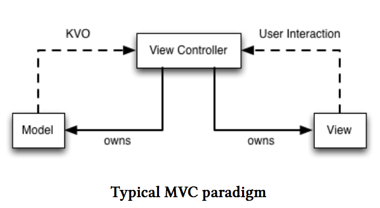
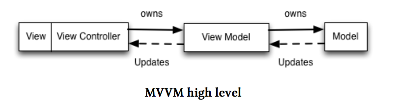

# 什么是MVVM

&nbsp;&nbsp;在传统的MVC架构的应用中，你有三种组件：数据模型、视图以及试图控制器。数据模型保持你的数据，而视图用来呈现这些数据。控制器介于这两个组件之间调解所有的交互。

&nbsp;&nbsp;希望于Apple已经很好地测试过它的业务逻辑了。剩下的视图控制器它很少进行单元测试。

&nbsp;&nbsp;当新的数据到达时，model会通知ViewController（通常是通过键-值观察(KVO)的方式），然后ViewController会更新View。当View接收交互时，ViewController会更新Model。



&nbsp;&nbsp;正如你所看到的ViewController隐式地负责很多事情：验证输入、将模型数据映射到面向用户的信息、操作视图层次结构等等。

&nbsp;&nbsp;MVVM将大量的类似上面的业务逻辑从viewController中抽离出来了。



&nbsp;&nbsp;在MVVM中，我们趋向于将view和view controller作为一个整体（这也解释了为什么不称它为MVVCVM),新的viewModel代替原来的viewController协调view与model之间的交互。

&nbsp;&nbsp;对这种MVVM架构中的"更新"机制，我们没有什么概念。实际上也没有什么关于MVVM的东西迫使你使用特定的机制来更新视图模型或视图。但在本书的范围内，我们将使用ReactiveCocoa来做处理这个。

&nbsp;&nbsp;ReactiveCocoa将会监控数据模型(model)的变化，并将这个变化映射到视图模型(viewModel)的属性上，执行任意必要的业务逻辑。

&nbsp;&nbsp;举一个具体的例子：假设我们的模型包含一个“日期”(用`dateAdded`表示)，我们想要监控这个“日期”的变化，来更新我们视图模型(viewModel)的属性`dateAdded`.模型(model)的属性是一个`NSDate`的实例，但视图模型(viewModel)中对应的属性是从它转换过来的`NSString`。这种绑定看起来跟下面的代码类似(在viewModel的初始化方法中进行)：

```Objective-C
RAC(self, dateAdded) = [RACObserve(self.model,dateAdded) map:^(NSDate *date) {
	return [[ViewModel dateFormatter] stringFromDate:date];
}];
```

&nbsp;&nbsp;`dateFormatter`是ViewModel的一个类方法，它缓存了一个`NSDateFormatter`实例以便复用(创建NSDateFormatter代价昂贵)。
接下来，view controller 可以监控viewModel的`dateAdded`属性将它跟一个`label`进行绑定。

```
RAC(self.label, text) = RACObserve(self.viewModel, dateAdded);
```

&nbsp;&nbsp;现在，我们已经将日期转换为字符串到视图模型的过程抽象出来了，在(viewModel)中我们可以为这个业务逻辑编写单元测试。这个例子看起来简单，但就像我们看到的，它显著地减少了你的视图控制器中的业务逻辑。
